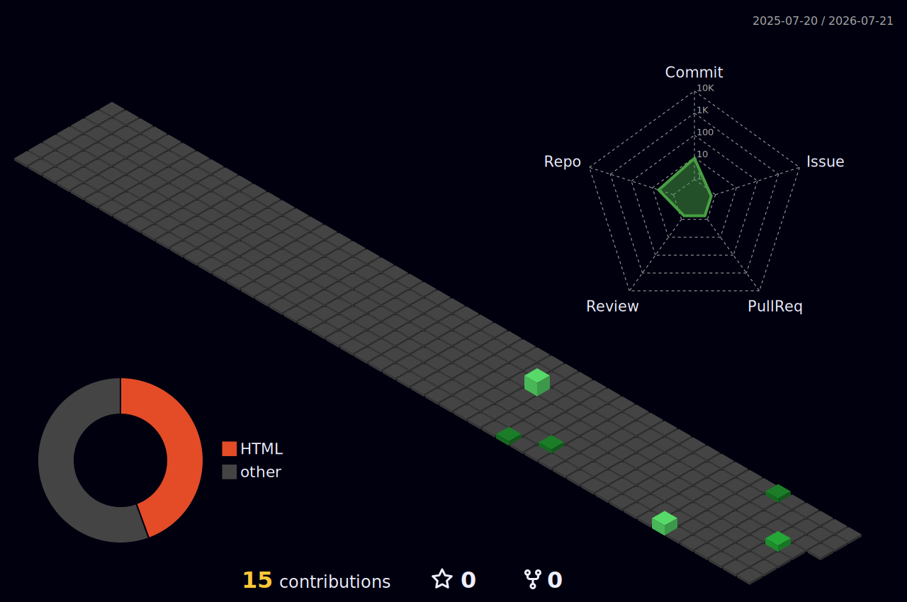

# 
👋 Hello World, I'm Vishal Gupta!

  

---

### 🌱 My Journey Starts Here
I'm at the very beginning of my GitHub journey! I created this profile to track my learning, share my early projects, and eventually start contributing to the open-source community. 

* 🎓 **Currently studying:** Bachelor of Computer Applications (BCA).
* 💻 **Currently learning:** Diving into Java, Android development, and backend basics.
* 🐧 **My setup:** Tinkering with Arch Linux and getting comfortable with the terminal.
* 🎯 **Goals for this year:** Push my first commits, build some fun beginner projects, and master version control.

---

### 🛠️ Tools I'm Exploring

  
  
  
  

---

### 📊 Building My Commit History (3D)
*My contribution graph is an empty canvas right now, but I'm excited to start filling it up with green squares!*

  
  

---

  

